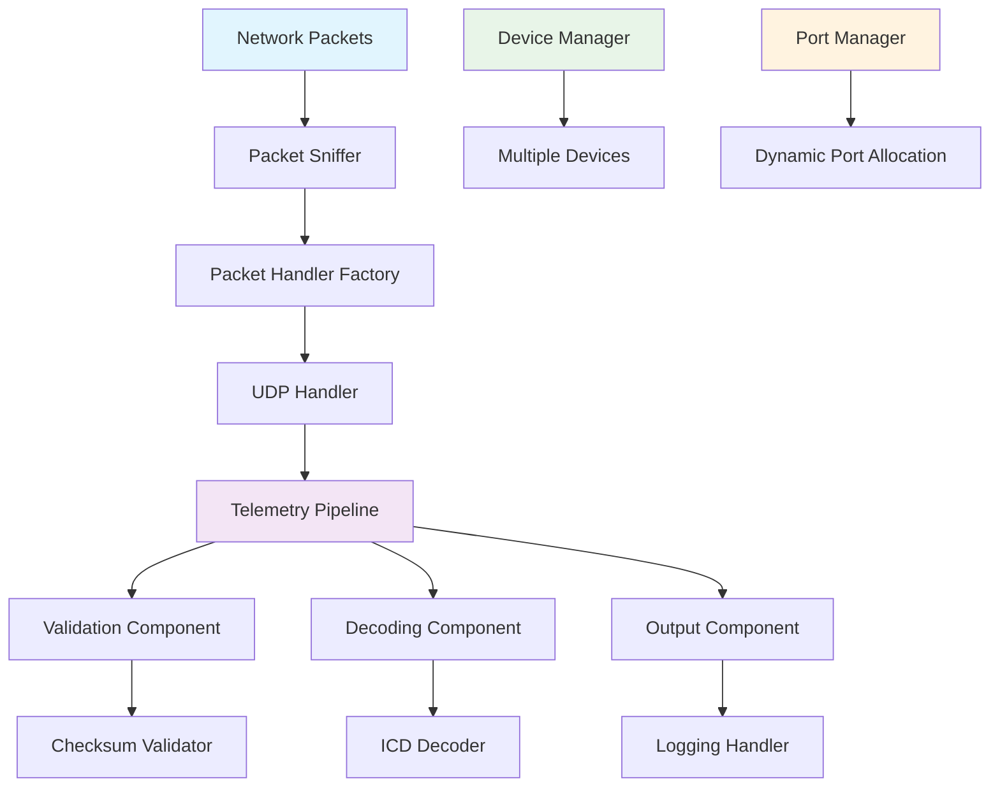
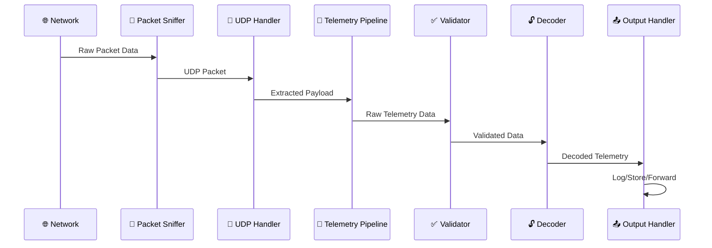

# 📡 TelemetryDevice - Real-time Telemetry Data Processing System

[](https://dotnet.microsoft.com/)
[](https://docs.microsoft.com/en-us/dotnet/csharp/)
[](LICENSE)
[](https://github.com/yourusername/telemetrydevice)

> **A high-performance .NET 9 web application designed for real-time telemetry data processing from various sources using a modular pipeline-based architecture.**

## 🎯 Overview

TelemetryDevice is a sophisticated telemetry processing system that combines network packet sniffing, data validation, decoding, and output handling capabilities. Built with modern .NET 9 and employing enterprise-grade design patterns, it provides a robust foundation for telemetry device management and data processing.

### ✨ Key Highlights

- **Real-time Processing**: Live telemetry data capture and processing
- **Modular Architecture**: Plugin-based pipeline system for extensibility
- **Multi-device Support**: Manage multiple telemetry devices simultaneously
- **Network Flexibility**: Dynamic port management and switching capabilities
- **Enterprise Patterns**: Builder, Director, and Pipeline patterns implementation

---

## 🏗️ System Architecture



### 🔧 Core Components

| Component | Purpose | Technology |
|-----------|---------|------------|
| **Pipeline System** | Modular data processing using Builder pattern | .NET 9, C# 13 |
| **Packet Sniffer** | Network packet capture and monitoring | SharpPcap |
| **Device Manager** | Device lifecycle and channel management | ASP.NET Core |
| **ICD Directory** | Data format definitions and parsing | JSON, Custom Parsers |
| **Port Manager** | Network port allocation and switching | System.Net |

### 🎨 Design Patterns

- **🏗️ Builder Pattern**: Constructs flexible data processing pipelines
- **🎯 Director Pattern**: Orchestrates pipeline construction workflows
- **🔄 Pipeline Pattern**: Sequential data processing through modular components
- **🏭 Factory Pattern**: Creates appropriate packet handlers based on protocol
- **📦 Dependency Injection**: Manages service lifecycles and dependencies

---

## 🚀 Features

### 📊 Data Processing Pipeline
- ✅ **Data Validation**: Integrity checks with checksum validation
- 🔓 **Data Decoding**: Convert raw telemetry using ICD specifications
- 📤 **Output Handling**: Configurable processors (logging, storage, forwarding)
- 🔄 **Real-time Processing**: Asynchronous data flow using System.Threading.Tasks.Dataflow

### 🌐 Network Management
- 🔌 **Multi-port Support**: Monitor multiple network ports simultaneously
- ⚡ **Dynamic Port Management**: Add/remove ports at runtime
- 🔄 **Port Switching**: Dynamic port reassignment capabilities
- 📡 **Protocol Support**: UDP packet handling with extensible factory pattern

### 🎛️ Device Management
- 📱 **Multi-device Support**: Manage multiple telemetry devices
- 📍 **Location Tracking**: Geographic positioning support
- 📺 **Channel Management**: Multiple data channels per device
- 🏷️ **Device Identification**: Tail ID-based device tracking

### 🔧 Configuration & Monitoring
- ⚙️ **ICD Configuration**: JSON-based Interface Control Documents
- 📊 **OpenAPI Documentation**: Auto-generated API documentation
- 🔍 **Development Tools**: Swagger UI for API testing
- 📝 **Comprehensive Logging**: Structured logging throughout the pipeline

---

## 💻 Technology Stack

| Category | Technologies |
|----------|--------------|
| **Framework** | .NET 9, ASP.NET Core |
| **Language** | C# 13.0 with latest features |
| **Networking** | SharpPcap for packet capture |
| **Serialization** | Newtonsoft.Json for JSON processing |
| **Async Processing** | System.Threading.Tasks.Dataflow |
| **Documentation** | OpenAPI/Swagger |
| **Development** | Visual Studio 2022 |

---

## 📁 Project Structure

```
TelemetryDevice/
├── 📁 Controllers/                    # 🎮 API Controllers
│   ├── TelemetryDeviceController.cs   # Device management endpoints
│   └── SniffersController.cs          # Packet sniffer control
├── 📁 Services/                       # 🔧 Business Logic Layer
│   ├── 📁 Builders/                   # 🏗️ Pipeline Builder Pattern
│   │   ├── IPipelineBuilder.cs
│   │   ├── PipelineBuilder.cs
│   │   └── PipelineDirector.cs
│   ├── 📁 Helpers/                    # 🛠️ Pipeline Components
│   │   ├── 📁 Decoder/                # Data decoding logic
│   │   ├── 📁 Output/                 # Output handling
│   │   └── 📁 Validator/              # Data validation
│   ├── 📁 PipeLines/                  # 🔄 Pipeline Implementations
│   ├── 📁 Sniffer/                    # 📡 Packet Sniffing
│   ├── 📁 PortsManager/               # 🔌 Port Management
│   ├── 📁 Factories/                  # 🏭 Factory Patterns
│   │   └── 📁 PacketHandler/          # Protocol-specific handlers
│   └── TelemetryDeviceManager.cs      # 📱 Device lifecycle management
├── 📁 Models/                         # 📊 Data Models
│   ├── TelemetryDevice.cs
│   ├── Channel.cs
│   ├── Location.cs
│   └── Result.cs
├── 📁 Dto/                           # 📤 Data Transfer Objects
│   └── CreateTelemetryDeviceDto.cs
├── 📁 Common/                        # 🔧 Shared Components
│   ├── 📁 Enums/
│   └── TelemetryDeviceConstants.cs
├── 📁 Config/                        # ⚙️ Configuration
│   └── NetworkingConfiguration.cs
└── Program.cs                        # 🚀 Application Entry Point
```

---

## ⚙️ Configuration

### 📄 ICD (Interface Control Document) Settings

Configure telemetry data format definitions through JSON files:

```json
{
  "ICDFilePath": "Files/ICD/",
  "NetworkConfiguration": {
    "DefaultPorts": [8000, 8001],
    "BufferSize": 4096,
    "TimeoutMs": 5000
  },
  "Logging": {
    "LogLevel": {
      "Default": "Information",
      "TelemetryDevice": "Debug"
    }
  }
}
```

### 🔌 Default Network Configuration

The application initializes with:
- **Primary Port**: 8000
- **Secondary Port**: 8001
- **Protocol**: UDP
- **Buffer Size**: 4KB

---

## 🌐 API Endpoints

### 📱 Telemetry Device Management

#### ➕ Add Telemetry Device
```http
POST /api/TelemetryDevice/add-telemetry-device
Content-Type: application/json

{
  "tailId": 1,
  "portNumbers": [8000, 8001],
  "location": {
    "x": 32.0851,
    "y": 34.7818
  }
}
```

**Response:**
```json
{
  "success": true,
  "message": "Telemetry device added successfully",
  "deviceId": "device_001"
}
```

#### ➖ Remove Telemetry Device
```http
POST /api/TelemetryDevice/remove-telemetry-device?tailId=1
```

#### 🔄 Switch Ports
```http
POST /api/TelemetryDevice/switch-port?sourcePort=8000&destinationPort=8002
```

### 📡 Packet Sniffer Management

#### ➕ Add Port to Sniffer
```http
POST /api/Sniffers/add-port?portNumber=8003
```

#### ➖ Remove Port from Sniffer
```http
POST /api/Sniffers/remove-port?portNumber=8003
```

#### ▶️ Start Sniffer
```http
GET /api/Sniffers/run
```

#### ⏹️ Stop Sniffer
```http
GET /api/Sniffers/stop
```

---

## 🚀 Getting Started

### 📋 Prerequisites

- **✅ .NET 9 SDK** or later
- **✅ Visual Studio 2022** (17.0+) or VS Code
- **✅ Network access** for packet sniffing
- **✅ Administrator privileges** (for packet capture)

### 📦 Installation

1. **📥 Clone the repository**
   ```bash
   git clone https://github.com/yourusername/telemetrydevice.git
   cd TelemetryDevice
   ```

2. **🔄 Restore dependencies**
   ```bash
   dotnet restore
   ```

3. **⚙️ Configure ICD files**
   ```bash
   # Create ICD directory structure
   mkdir -p TelemetryDevice/bin/Debug/net9.0/Files/ICD
   
   # Copy your ICD JSON files to the ICD directory
   cp your-icd-files/*.json TelemetryDevice/bin/Debug/net9.0/Files/ICD/
   ```

4. **🏗️ Build the solution**
   ```bash
   dotnet build
   ```

5. **🚀 Run the application**
   ```bash
   dotnet run --project TelemetryDevice
   ```

6. **🌐 Access the application**
   - **API Base**: `https://localhost:5001` or `http://localhost:5000`
   - **Swagger UI**: `https://localhost:5001/swagger`
   - **OpenAPI Spec**: `https://localhost:5001/swagger/v1/swagger.json`

### ⚡ Quick Start Example

```bash
# 1. Start the application
dotnet run --project TelemetryDevice

# 2. Add a telemetry device (PowerShell/curl)
$headers = @{ "Content-Type" = "application/json" }
$body = @{
    tailId = 1
    portNumbers = @(8000, 8001)
    location = @{ x = 0; y = 0 }
} | ConvertTo-Json

Invoke-RestMethod -Uri "https://localhost:5001/api/TelemetryDevice/add-telemetry-device" -Method POST -Headers $headers -Body $body

# 3. Start packet sniffing
Invoke-RestMethod -Uri "https://localhost:5001/api/Sniffers/run" -Method GET

# 4. Monitor logs for telemetry data processing
```

---

## 🔄 Pipeline Processing Flow



1. **📡 Packet Capture**: Raw network packets captured via SharpPcap
2. **🔧 Protocol Handling**: UDP-specific processing through factory pattern
3. **✅ Validation**: Data integrity checks using configurable validators
4. **🔓 Decoding**: Convert binary data to structured telemetry using ICD definitions
5. **📤 Output Processing**: Handle processed data (logging, storage, forwarding)

---

## 🔧 Extending the System

### 🏗️ Adding New Pipeline Components

Implement the `IPipelineComponent` interface:

```csharp
public class CustomTelemetryProcessor : IPipelineComponent
{
    private readonly ILogger<CustomTelemetryProcessor> _logger;

    public CustomTelemetryProcessor(ILogger<CustomTelemetryProcessor> logger)
    {
        _logger = logger;
    }

    public async Task ProcessAsync(byte[] data, CancellationToken cancellationToken = default)
    {
        _logger.LogInformation("Processing {DataLength} bytes with custom processor", data.Length);
        
        // Custom processing logic here
        await ProcessTelemetryDataAsync(data, cancellationToken);
        
        _logger.LogDebug("Custom processing completed successfully");
    }

    private async Task ProcessTelemetryDataAsync(byte[] data, CancellationToken cancellationToken)
    {
        // Your custom implementation
        await Task.CompletedTask;
    }
}
```

### 📤 Custom Output Handlers

Implement the `IOutputHandler` interface:

```csharp
public class DatabaseOutputHandler : IOutputHandler
{
    private readonly IDbContext _dbContext;
    private readonly ILogger<DatabaseOutputHandler> _logger;

    public DatabaseOutputHandler(IDbContext dbContext, ILogger<DatabaseOutputHandler> logger)
    {
        _dbContext = dbContext;
        _logger = logger;
    }

    public async Task HandleOutputAsync(Dictionary<TelemetryFields, double> decodedData)
    {
        try
        {
            var telemetryRecord = new TelemetryRecord
            {
                Timestamp = DateTime.UtcNow,
                Data = JsonConvert.SerializeObject(decodedData)
            };

            await _dbContext.TelemetryRecords.AddAsync(telemetryRecord);
            await _dbContext.SaveChangesAsync();
            
            _logger.LogInformation("Telemetry data saved to database successfully");
        }
        catch (Exception ex)
        {
            _logger.LogError(ex, "Failed to save telemetry data to database");
            throw;
        }
    }
}
```

### 🔌 Custom Packet Handlers

Add support for new protocols:

```csharp
public class TcpHandler : IPacketHandler
{
    public bool CanHandle(PacketType packetType) => packetType == PacketType.Tcp;

    public async Task<byte[]> HandleAsync(byte[] packetData)
    {
        // TCP-specific processing logic
        return await ProcessTcpPacketAsync(packetData);
    }
}

// Register in DI container
services.AddScoped<IPacketHandler, TcpHandler>();
```

---

## 🛠️ Development

### 🏗️ Building the Project
```bash
# Clean and build
dotnet clean
dotnet build

# Build in Release mode
dotnet build --configuration Release
```

### 🧪 Running Tests
```bash
# Run all tests
dotnet test

# Run tests with coverage
dotnet test --collect:"XPlat Code Coverage"

# Run specific test project
dotnet test TelemetryDevice.Tests
```

### 🔍 Code Analysis
```bash
# Run code analysis
dotnet format --verify-no-changes

# Check for security vulnerabilities
dotnet list package --vulnerable
```

### 🐛 Debugging

1. **Set breakpoints** in your IDE
2. **Configure launch settings** in `Properties/launchSettings.json`
3. **Use structured logging** for runtime diagnostics
4. **Enable detailed packet logging** in development mode

---

## 📦 Dependencies

| Package | Version | Purpose |
|---------|---------|---------|
| Microsoft.AspNetCore.OpenApi | 9.0.8 | API documentation |
| Newtonsoft.Json | 13.0.4-beta1 | JSON serialization |
| Newtonsoft.Json.Bson | 1.0.3 | Binary JSON support |
| SharpPcap | 6.3.1 | Network packet capture |
| System.Threading.Tasks.Dataflow | 10.0.0-preview.6 | Asynchronous processing |
| Shared | Project Reference | Common utilities |

### 🔄 Updating Dependencies
```bash
# Update all packages to latest versions
dotnet add package Microsoft.AspNetCore.OpenApi
dotnet add package Newtonsoft.Json
dotnet add package SharpPcap
dotnet add package System.Threading.Tasks.Dataflow
```

---

## 🐳 Docker Support

### 📄 Dockerfile
```dockerfile
FROM mcr.microsoft.com/dotnet/aspnet:9.0 AS base
WORKDIR /app
EXPOSE 8080
EXPOSE 8081

FROM mcr.microsoft.com/dotnet/sdk:9.0 AS build
WORKDIR /src
COPY ["TelemetryDevice/TelemetryDevices.csproj", "TelemetryDevice/"]
RUN dotnet restore "TelemetryDevice/TelemetryDevices.csproj"
COPY . .
WORKDIR "/src/TelemetryDevice"
RUN dotnet build "TelemetryDevices.csproj" -c Release -o /app/build

FROM build AS publish
RUN dotnet publish "TelemetryDevices.csproj" -c Release -o /app/publish

FROM base AS final
WORKDIR /app
COPY --from=publish /app/publish .
ENTRYPOINT ["dotnet", "TelemetryDevices.dll"]
```

### 🚀 Docker Compose
```yaml
version: '3.8'
services:
  telemetry-device:
    build: .
    ports:
      - "5000:8080"
      - "5001:8081"
    environment:
      - ASPNETCORE_ENVIRONMENT=Production
    volumes:
      - ./ICD:/app/Files/ICD
    networks:
      - telemetry-network

networks:
  telemetry-network:
    driver: bridge
```

---

## 📊 Performance & Monitoring

### 📈 Key Metrics
- **Packet Processing Rate**: Packets/second
- **Pipeline Latency**: End-to-end processing time
- **Memory Usage**: Pipeline component memory footprint
- **Error Rate**: Failed processing percentage

### 🔍 Monitoring Tools
- **Application Insights**: Azure-based telemetry
- **Prometheus**: Metrics collection
- **Grafana**: Visualization dashboards
- **Structured Logging**: Serilog integration

---

## 🔒 Security Considerations

- **🔐 Network Security**: Encrypted packet transmission
- **🛡️ Input Validation**: Comprehensive data validation
- **🔒 Authentication**: API endpoint security
- **📝 Audit Logging**: Security event tracking
- **🔑 Secrets Management**: Secure configuration handling

---

## 🤝 Contributing

We welcome contributions! Please follow these guidelines:

### 📝 Development Process
1. **🍴 Fork** the repository
2. **🌿 Create** a feature branch (`git checkout -b feature/amazing-feature`)
3. **✍️ Make** your changes with comprehensive tests
4. **✅ Ensure** all tests pass and code follows standards
5. **📝 Commit** your changes (`git commit -m 'Add amazing feature'`)
6. **🚀 Push** to the branch (`git push origin feature/amazing-feature`)
7. **📥 Submit** a Pull Request

### 📋 Code Standards
- Follow **C# coding conventions**
- Maintain **95%+ test coverage**
- Use **descriptive commit messages**
- **Document public APIs** with XML comments
- **Follow SOLID principles**

### 🧪 Testing Requirements
- **Unit tests** for all new functionality
- **Integration tests** for API endpoints
- **Performance tests** for critical paths
- **Documentation updates** for new features

---

## 📄 License

This project is licensed under the **MIT License** - see the [LICENSE](LICENSE) file for details.

```
MIT License

Copyright (c) 2025 TelemetryDevice Project

Permission is hereby granted, free of charge, to any person obtaining a copy
of this software and associated documentation files (the "Software"), to deal
in the Software without restriction, including without limitation the rights
to use, copy, modify, merge, publish, distribute, sublicense, and/or sell
copies of the Software, and to permit persons to whom the Software is
furnished to do so, subject to the following conditions:

The above copyright notice and this permission notice shall be included in all
copies or substantial portions of the Software.
```

---

## 🔗 Related Projects

- **[Shared Library](../Shared)**: Common utilities and configurations

---

## 💬 Support & Community

### 🌟 Acknowledgments
- **SharpPcap Team** for excellent packet capture capabilities
- **Microsoft .NET Team** for the fantastic .NET 9 framework
- **Contributors** who have helped shape this project

---

<div align="center">

**Built with ❤️ using .NET 9**

*Designed for high-performance telemetry data processing*

</div>